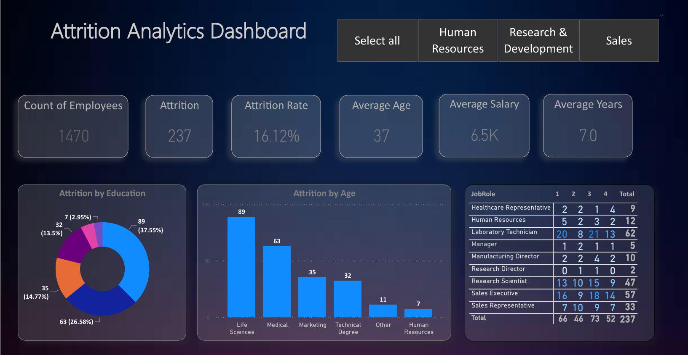
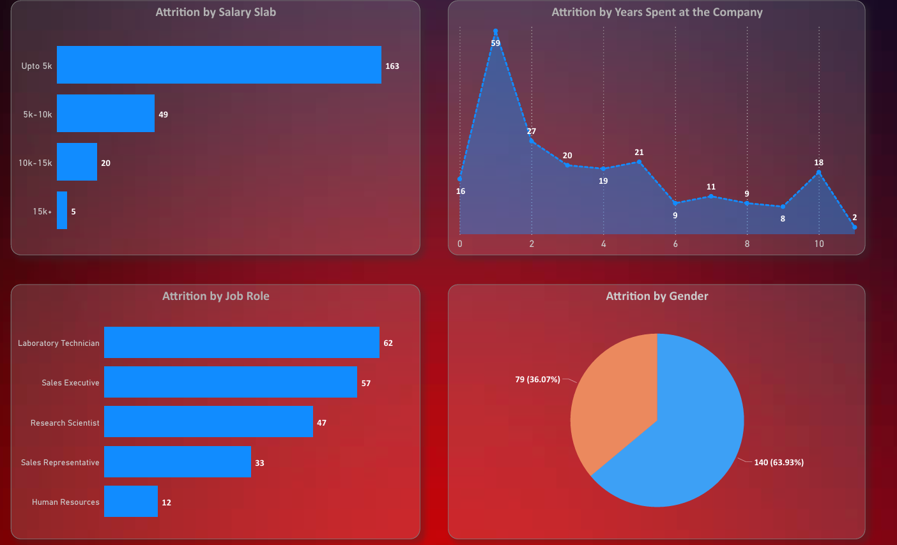

# churn_analysis on POWER BI

# Attrition Dashboard

### Dashboard Link : https://drive.google.com/file/d/10ctZx53u9zvF7H4e4S7kPg1RjiriDFX0/view?usp=sharing

## Problem Statement

This dashboard helps the companyto  understand their customers better. It helps the company and HR team to  know if their customers are satisfied with their services, and the main factors for the company attrition. Through different factors and KPIs, they get to know several reasons and conditions for churnand the improvement area, & thus they can improve their services by identifying these area. It also lets them know the average churn, average salary for churn, gender, average age of churn, departments pf churn. thus since by using this dashboard they have identified this problem, they can further work on factors responsible.

### Steps followed 

- Step 1 : Load data into Power BI Desktop, dataset is a csv file.

- Step 2 : Open power query editor & in view tab under Data preview section, check "column distribution", "column quality" & "column profile" options.

- Step 3 : Also since by default, profile will be opened only for 1000 rows so you need to select "column profiling based on entire dataset".

- Step 4 : It was observed that in none of the columns errors & empty values were present except column named "Arrival Delay".

- Step 5 : For calculating average delay time, null values were not taken into account as only less than 1% values are null in this column 

- Step 6 : In the report view, under the view tab, theme was selected.

- Step 7 : Since the data contains various ratings, thus in order to represent ratings, a new visual was added using the three ellipses in the visualizations pane in report view. 

- Step 8 : Visual filters (Slicers) were added for four departments named "Select All", "Human Resources", "Research & Development" & "Sales".

- Step 9 : Card visuals were added to the canvas, representing Count of employees, attrition, attrition rate, aveerage age, average salary, average years.     
  
- Step 10 : A chart was also added to the report design area representing the Attrition rate by Age, Education, Salary slabs, Years Spent, Job roles, and Gender.

- Step 11 : New Measure for Attrition Rate at different teams was displayed using Matrix.

  

